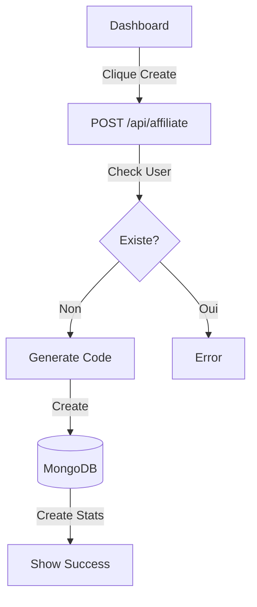
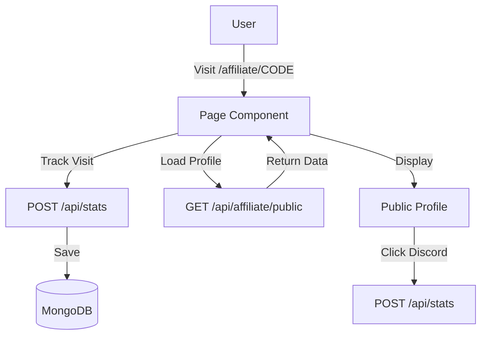

# 🔧 Système d'Affiliation - Documentation Technique

## API Endpoints

### Authentication

#### Sign In (NextAuth)
```
POST /api/auth/signin/discord
```

#### Session
```
GET /api/auth/session
```

---

### Affiliations

#### Créer une affiliation
```
POST /api/affiliate
```
**Auth**: Requis (session Discord)

**Response**:
```json
{
  "_id": "507f1f77bcf86cd799439011",
  "userId": "discord-id-123",
  "discordUsername": "username",
  "discordInvite": "https://discord.gg/...",
  "affiliateCode": "aB1cD2eF",
  "youtube": { "url": "", "displayName": "" },
  "twitter": { "url": "", "displayName": "" },
  "roblox": { "username": "", "userId": 0 },
  "favoriteGames": [],
  "partnered": true,
  "partnerName": "Sai Café",
  "createdAt": "2024-01-01T00:00:00Z"
}
```

#### Récupérer l'affiliation (authentifiée)
```
GET /api/affiliate
```
**Auth**: Requis (session Discord)

---

#### Mettre à jour l'affiliation
```
PUT /api/affiliate
```
**Auth**: Requis (session Discord)

**Body**:
```json
{
  "youtube": {
    "url": "https://youtube.com/@username",
    "displayName": "Mon Canal"
  },
  "twitter": {
    "url": "https://twitter.com/username",
    "displayName": "@username"
  },
  "roblox": {
    "username": "RobloxUsername",
    "userId": 123456789
  },
  "favoriteGames": [
    {
      "gameId": 123456,
      "gameName": "Mon Jeu Préféré",
      "position": 1
    }
  ],
  "profileDescription": "Je suis un partenaire de Sai Café..."
}
```

**Champs modifiables**: `youtube`, `twitter`, `roblox`, `favoriteGames`, `profileDescription`

---

#### Récupérer l'affiliation (publique)
```
GET /api/affiliate/public?code=aB1cD2eF
```
**Auth**: Non requis

**Response**: Retourne les informations publiques de l'affilié

---

### Statistiques

#### Tracker une action
```
POST /api/stats
```
**Auth**: Non requis

**Body**:
```json
{
  "affiliateCode": "aB1cD2eF",
  "eventType": "page_visit" // ou "discord_click"
}
```

---

#### Récupérer les statistiques
```
GET /api/stats?code=aB1cD2eF
```
**Auth**: Non requis

**Response**:
```json
{
  "affiliateCode": "aB1cD2eF",
  "pageVisits": 150,
  "discordButtonClicks": 45,
  "uniqueVisitors": 120,
  "uniqueDiscordClickVisitors": 35,
  "updatedAt": "2024-01-15T12:30:00Z"
}
```

---

## Modèles de données

### User
```typescript
{
  _id: ObjectId;
  discordId: string; // Unique
  discordUsername: string;
  discordEmail: string;
  discordAvatar: string;
  discordDiscriminator: string;
  createdAt: Date;
  updatedAt: Date;
}
```

### Affiliate
```typescript
{
  _id: ObjectId;
  userId: string; // Unique (Discord ID)
  discordUsername: string;
  discordInvite: string;
  affiliateCode: string; // Unique
  youtube?: {
    url: string;
    displayName: string;
  };
  twitter?: {
    url: string;
    displayName: string;
  };
  roblox?: {
    username: string;
    userId: number;
  };
  favoriteGames?: [
    {
      gameId: number;
      gameName: string;
      position: number;
    }
  ]; // Max 3
  partnerName: string;
  partnered: boolean;
  partnerLogoUrl?: string;
  profileDescription: string;
  customBackgroundUrl?: string;
  isActive: boolean;
  createdAt: Date;
  updatedAt: Date;
}
```

### AffiliateStatistics
```typescript
{
  _id: ObjectId;
  affiliateCode: string; // Unique
  userId: string;
  pageVisits: number;
  discordButtonClicks: number;
  uniqueVisitors: number;
  uniqueDiscordClickVisitors: number;
  visitors: [
    {
      ipHash: string; // SHA256 hash
      userAgent: string;
      country?: string;
      city?: string;
      timestamp: Date; // TTL 30 jours
    }
  ];
  createdAt: Date;
  updatedAt: Date;
}
```

---

## Flux d'utilisation

### 1. Inscription/Connexion
```mermaid
graph TD
    A[Utilisateur] -->|Clique Login| B[/auth/signin]
    B -->|Redirects| C[Discord OAuth]
    C -->|Approve| D[Callback]
    D -->|Create/Update User| E[(MongoDB)]
    E -->|Session Created| F[Dashboard]
```

### 2. Création d'affiliation


### 3. Accès à la page d'affiliation


---

## Sécurité

### Hash IP
```javascript
const crypto = require('crypto');
const ip = "192.168.1.1";
const hash = crypto.createHash('sha256').update(ip).digest('hex');
// Résultat: ne peut pas être inversé
```

### Vérification unique visiteur
```javascript
const existingVisitor = stats.visitors.find(
  v => v.ipHash === ipHash && v.userAgent === userAgent
);
```

---

## Exemples d'utilisation (Frontend)

### Tracker une visite
```javascript
// Dans le composant AffiliatePage
useEffect(() => {
  const trackVisit = async () => {
    await fetch('/api/stats', {
      method: 'POST',
      headers: { 'Content-Type': 'application/json' },
      body: JSON.stringify({
        affiliateCode: 'aB1cD2eF',
        eventType: 'page_visit',
      }),
    });
  };
  
  trackVisit();
}, [affiliateCode]);
```

### Mettre à jour le profil
```javascript
const handleSave = async (formData) => {
  const response = await fetch('/api/affiliate', {
    method: 'PUT',
    headers: { 'Content-Type': 'application/json' },
    body: JSON.stringify(formData),
  });
  
  const data = await response.json();
  console.log('Profile updated:', data);
};
```

---

## Considérations de performance

1. **Indexing MongoDB**:
   ```javascript
   // Index sur affiliateCode pour les requêtes rapides
   db.affiliate.createIndex({ affiliateCode: 1 })
   
   // Index sur userId pour les requêtes par utilisateur
   db.affiliate.createIndex({ userId: 1 })
   
   // Index TTL sur timestamp pour les statistiques
   db.affiliatestatistics.createIndex({ 'visitors.timestamp': 1 },
   { expireAfterSeconds: 2592000 })
   ```

2. **Limitations**:
   - Un utilisateur = Une affiliation
   - Un code = Un affilié
   - Max 3 jeux favoris

3. **Caching**:
   - Les statistiques sont calculées à la volée
   - Peut être optimisé avec Redis pour les gros volumes

---

## Dépannage API

### Erreur 401 - Non authentifié
- Vérifiez que l'utilisateur est connecté
- Vérifiez que la session est valide

### Erreur 404 - Affilié non trouvé
- Vérifiez le code d'affiliation
- Vérifiez que l'affilié est actif (`isActive: true`)

### Erreur 500 - Erreur serveur
- Vérifiez la connexion MongoDB
- Vérifiez les logs du serveur
- Vérifiez les variables d'environnement
